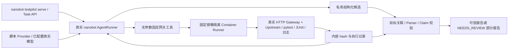

# TestPilot：nanobot 企业测试 Agent 二开

已有 `qa-kb-service` 负责知识检索和 ACL，nanobot 负责模型与工具循环。二开的新增价值是
把测试行动、真实结果和可发布结论连接起来，再逐步增加持久恢复、权限与隔离执行。
完整目标见 [TRD](../../智能测试Agent_nanobot二开_TRD_v1.md)。

## 本次已落地



- `testpilot/domain.py`：冻结、禁止额外字段的目标/执行/计数/声明合同。
- `execution.py`：固定 source/oracle、30 秒 deadline、干净环境、同实例重复回放。
- `artifacts.py`：内容寻址、大小限制、hash 读回验证、拒绝路径逃逸和 symlink。
- `junit.py`：安全 XML、嵌套 suite、按 testcase 计算互斥计数、planned 守恒。
- `evidence.py`：Scope/hash/终态/exit code/证据引用/计数/声明闸门。
- `nanobot_adapter.py`：唯一 Runner/Tool 适配点；CLI 另复用 Provider 工厂，每任务独立工具表，不直接发布模型最终文本。
- `container_runner.py`：固定不可变镜像、非 root、只读根文件系统、network none、资源限额、取消后确认清理。
- `task_api.py`：开发 Bearer 认证、异步任务、主体隔离、请求幂等、容量限制、状态/报告/产物/取消 API。
- `storage/postgres.py` / `storage/001_ledger.sql`：PG Task/Run/Operation/Attempt、租约、幂等、事件/outbox/checkpoint 事务。
- `durable_api.py` / `durable_runtime.py`：PG 队列轮询、SKIP LOCKED、lease epoch、预算保留和 scoped 状态/报告查询。
- `recoverable_runner.py`：固定 Job 名持久保留，恢复先对账；结果已提交则回放，未知写不重新提交。
- `scheduler.py`：独立、无需模型的 Job 轮询/对账/截止清理，可用单独 CLI 进程运行。
- `runtime_contracts.py`：完整 tool_call/result checkpoint 后 WAIT_EXTERNAL 宿主控制，释放 Agent Worker。
- `progress.py`：重复观测/A-B 震荡检测，PG 持久记录，停滞时保留真实执行事实与部分报告。
- `event_stream.py`：scoped SSE、Last-Event-ID 重连、每轮重新授权、无序号心跳与明确 resync。
- `runner/`：独立执行镜像；运行前校验源码和独立 oracle hash，Docker socket/密钥不进入容器。
- 固定 oracle 通过真实 HTTP 请求验证读重试、写不重试、路由优先级和限流；Gateway 对 Upstream 也发起真实请求。

这是 **M0 + M1 本地固定目标纵切 + 模块 E 的首个可运行子集**。
已实现 Task API、HTTP 被测 gateway 和独立容器 Runner；目标仍是工作树固定 fixture，
第三批已接入 PostgreSQL 任务事实源及固定 Job crash recovery。
第五批已接入 S3、JWT 身份、持久审批、Plan/Context 和任务级 RAG，并提供 `/console`。
启动、权限和评测命令见 [治理 Runbook](governance-runbook.md)。企业 Git commit manifest、完整 OIDC、
通用企业 Runner 与完整故障矩阵仍未完成，不能把本地固定目标验收当完整 M2–M5。

## 运行

推荐使用 [启动与验证 Runbook](runbook.md) 启动 `nanobot testpilot serve`。
PG 恢复模式见 [持久执行 Runbook](postgres-runbook.md)，用 `--durable` 显式开启；DB 失败不会降级为内存模式。
运行前构建 `runner/Dockerfile`，从环境提供随机开发 Token，并以不可变镜像 ID 准入。
带 `--config <nanobot配置>` 时复用既有 Provider；不带时使用脚本 Provider。
实际验证脚本为 `scripts/testpilot_live_smoke.py`，会启动 nanobot 进程、提交两条任务、
检查报告/幂等/产物/容器残留并停止服务。脚本 Provider 和真实模型的结果分别记录。

旧的受信宿主 fixture 演示仍可在无 Docker 时运行：

已有环境直接执行以下命令，不需要模型 Key、Docker 或 RAG 服务在线：

```bash
.venv/bin/python -m testpilot --mode healthy
.venv/bin/python -m testpilot --mode retry-write-bug
.venv/bin/python -m testpilot --mode retry-write-bug --claim-all-passed
```

第三条预期返回 exit code **2**，表示报告闸门拒绝虚假声明；真实 3 PASS / 1 FAIL 保留。
第二条 exit code 0 表示报告有效，**不表示测试通过**。这两个状态分别读取
`report_validated` 与 `quality_verdict`。全部通过只允许 planned>0 且 passed=planned。

产物保存到 `.local/testpilot/<task_id>/`：`report.json`、模板生成的 `report.md`、
`execution.json` 与 `artifacts/<sha256>`。默认输出被 Git 忽略。
`--output <directory>` 可指定位置，清理时只删除自己指定的任务目录即可。

新环境可按上游 `pyproject.toml` 安装 `.[dev]`；已测环境的 117 个依赖精确版本存于
`requirements-testpilot-py313.lock`。它是当前 macOS/Python 3.13 环境快照，尚未验证跨平台
重装，也不是企业发布所需的镜像 digest/全平台 lock。

`run_task(executor, provider, model)` 可以注入真实 `LLMProvider`。第二批已使用现有
`deepseek-flash` 成功验证两条任务；仅为 smoke，不是 held-out 模型准确率评估。
全局聊天和 RAG OAuth 配置不受影响。

## 验证与阶段清单

命令与真实结果见 [验证记录](verification.md)，设计取舍见 [ADR 001](adr/001-evidence-slice.md)。

- [x] M0：实际 SHA/许可证/依赖快照/源码签名审计。
- [x] 原 AgentRunner 工具协议复用，非另写 Agent Loop。
- [x] M1 固定目标纵切：Task API → AgentRunner → 独立 Runner → 真实 HTTP pytest/JUnit → 报告。
- [x] 模块 E 子集：无执行、假成功、目标漂移、hash 篡改、计数与证据引用负面验证。
- [x] GitHub 展示入口与独立 TestPilot CI。
- [x] 启动真实 nanobot Task API，脚本 Provider 和 DeepSeek 模型分别验证正常/缺陷任务。
- [x] 容器隔离探针、取消后确认移除、重复/并发取消和禁止自动重发。
- [ ] M1 企业目标接入：Git commit source manifest、服务端身份/环境快照、企业 Runner 契约。
- [x] M2 子集：PG Task/Run/Operation/Attempt、租约/fencing、Checkpoint、事件/outbox 同事务、原固定 Job 对账。
- [x] 真实 nanobot SIGKILL/重启：原 Docker Job 数量=1、原请求幂等、预算和租约 epoch 保留。
- [x] 外部等待释放 Worker、独立 Scheduler/Reconciler、原 Job 终态后才唤醒 Agent。
- [x] 持久 Progress Guard：重复观测与 A-B 路径震荡；范围是当前工具观测，不代表完整自主 Plan。
- [x] SSE 重连/断线/权限撤销/resync；报告发布事件在 Evidence Gate 后产生。
- [x] S3 条件写/远端读回/hash/任务路径隔离；实际 Garage 对象存储验收。
- [x] JWT 固定签名算法与 scope；独立审核、hash 绑定、派发事务一次消费、拒绝/过期。
- [x] 有界 Plan 版本、保护 Context/实际模型输入预算、分页产物、actor-bound MCP RAG。
- [x] 最小控制台：创建/任务列表/审批/Plan/SSE/报告/证据/取消。
- [ ] M2 完整验收：完整 F01–F05/F11–F13、GC 与版本化完整上下文恢复。
- [ ] M3：企业授权/审批、取消/进程树确认、外部幂等、rerun 与首轮失败保留、完整 Evidence 类型。
- [ ] M4：task 级预算、Plan/Progress Guard/上下文、受治理的按需 RAG、真实模型评测。
- [ ] M5：OIDC、SSE/控制台、真实 GitLab/CI Adapter、容量测量、运维 runbook。

建议每个阶段一个可评审 PR。当前分支基于原 RAG 分支；展示时保留上游来源，将 RAG
接入与 Runtime 增量分开说明，不将本地固定 fixture 的结果写成生产效果。

## 与 qa-kb-service 的分工

保持独立仓库。RAG 已通过 MCP 提供 `search`、版本/引用、上下文和降级状态，身份从服务端
OAuth introspection 或受信 stdio 配置获得，模型不能传 tenant/ACL principal。
任务级 RAG 已通过受控 MCP search 接入，服务端映射 actor 到 KB token；返回内容不授予权限。
完整引用保存为远端产物，要求知识的任务在拿到授权证据前不能派发 Job。
知识引用支撑“规范要求写请求不能重试”；completed run + JUnit 才能支撑“本次写请求测试失败”。

## 当前任务服务的生命周期

不带 `--durable` 的旧开发模式：任务状态与 Idempotency-Key 保存在进程内，并发上限 2、最多保留 100 个任务；超限 429。
进程内同主体同 key 同请求返回原 task，不同请求 409；Runner 同实例只执行一次 operation。
停止服务会取消活跃任务并确认容器清理。重启后不能从 API 恢复旧 task 查询，不能把它部署为共享任务服务。
报告/产物/operation 调查记录保留在本地文件中，但它们不是 PostgreSQL 任务账本。
带 `--durable`：任务/请求 key/原 run/operation/模型主循环预算保存在 PG，同 tenant/project 的有界队列最多 10 个活跃任务。
Worker 领取用 SKIP LOCKED，默认租约 30 秒、每 10 秒心跳；所有写回/工具准入要求有效 owner/epoch。
Job 未终态进入 WAITING_EXTERNAL，释放 Worker/租约；Scheduler 以独立租约做单次状态查询，等待时不调用模型。
Runner Job 保留唯一名称，恢复不重新 start 已有容器，已终态只读真实 JUnit/日志，无法查询则 UNKNOWN/NEEDS_REVIEW。
当前依赖同一 Docker daemon 和同一持久产物根目录。没有声称跨任意外部系统 exactly-once 或完整企业恢复。

新模块的启动、SSE 和独立 Scheduler 运行方式见 [异步执行 Runbook](async-runbook.md)。
