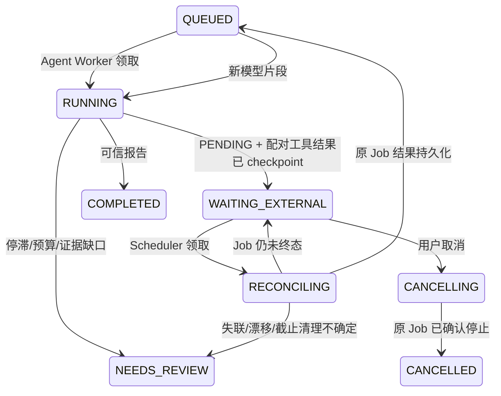

# 异步 Job、独立 Scheduler、Progress Guard 与 SSE

## 升级与启动

先按 [PG Runbook](postgres-runbook.md) 准备原数据库、产物目录和固定 Runner image。
002 是追加迁移，保留已发布的 001 校验和、旧任务和结果；升级不是重建数据库。

```bash
.venv/bin/nanobot testpilot migrate
# 默认在 API 进程内启动独立 Scheduler 协程，兼容已有启动入口。
.venv/bin/nanobot testpilot serve --durable --runner-image "$testpilot_image" --output .local/testpilot-pg
```

需要分成两个进程时：

```bash
# 进程一：API + Agent Workers。
.venv/bin/nanobot testpilot serve --durable --no-scheduler --workers 1 \
  --runner-image "$testpilot_image" --output .local/testpilot-pg
# 进程二：只查询 Job/对账/取消，不加载模型配置、不发模型请求。
.venv/bin/nanobot testpilot scheduler --runner-image "$testpilot_image" --output .local/testpilot-pg
```

两个进程要使用同一个 TESTPILOT_DATABASE_URL、Docker daemon、固定 image ID 和持久根目录。
Scheduler 不需要 TESTPILOT_API_TOKEN 或模型 Key。多个 Scheduler 通过 SKIP LOCKED 与 epoch 竞争，不共用内存唤醒。
`--job-poll-seconds` 默认 5 秒，后续约 5/15/30 秒退避；测试可设 0.05/0.1 秒。
next_check/next_wakeup 不得超过原 Job/Task deadline；等待、重启和退避不重置截止时间。

## 完整等待协议



工具收到 submit 的回执只返回 typed PENDING，不提供测试数字或 VERIFIED 声明。
nanobot 先为模型本轮的所有工具写出配对 result，再保存 tools_completed checkpoint；
Adapter 的 after_iteration 这时才抛出宿主 RuntimeYieldError，Worker 原子登记 Job、释放租约并返回调度循环。
控制信号发生在工具异常处理外，不会被当普通工具错误让模型反复 retry。
恢复期间查询 PENDING/UNKNOWN 的原 Job，不创建另一个同目标 Job，也不重新 start 旧容器。

等待时模型调用量保持不变，Worker 可以领取其他任务；Scheduler 单次 query 完成后释放自己的租约。
发现终态，先写实际 JUnit/日志和 PG result，再 requeue 唤醒模型。
取消与截止清理由 Scheduler 执行，不消耗模型轮数；paused 的匹配 Job 先解除 pause 再停止，确认 Docker 终态。
截止无法确认或 Job 丢失时保守 NEEDS_REVIEW，不把 submit 成功当测试通过。

## Progress Guard

Tool 名、参数与规范化 observation 产生 SHA256 指纹，不把每个 started 事件当有效进展。
连续三次相同观测或 A-B-A-B 震荡触发 progress.stalled，停止后续模型循环。
PG 保存有界四项 history，恢复不会清空历史规避停止规则；事件 payload 只有原因，不存原始工具内容。
停止后的部分报告保留已经验证的实际统计、产物和未完成说明，状态 NEEDS_REVIEW。
这只是首个观测级 guard；复杂 Plan、业务语义进展和 bounded reflection 仍待后续。

## SSE

```bash
curl -N -H "Authorization: Bearer $TESTPILOT_API_TOKEN" \
  http://127.0.0.1:8920/v1/tasks/task_xxx/events/stream
# 断线后按客户端最后完整收到的 event_seq 重新订阅。
curl -N -H "Authorization: Bearer $TESTPILOT_API_TOKEN" -H 'Last-Event-ID: 12' \
  http://127.0.0.1:8920/v1/tasks/task_xxx/events/stream
```

浏览器使用支持 Authorization 的 fetch streaming 客户端；不要把 Bearer 放 query string。
响应是 text/event-stream，持久事件有 id/event/data；data 含 task_id/run_id/event_seq/type/timestamp/public_payload。
每 20 秒 `: heartbeat`，不持久化、不占 seq。断线不取消任务，最终 report.validated 才表示可信报告可读取。
每轮查询重新认证和检查任务所有权；撤销/主体改变会发 access_revoked 后关闭，不继续返回内容。
未来 cursor 或已清除的保留窗口返回 HTTP 409 resync_required + snapshot；连接内发现 gap 也显式提示，不静默跳过。
读取/结束写入各有 5 秒等待上限，慢客户端不阻塞 Worker/Job。终态事件全部发出后连接自然结束。
private checkpoint 与模型思维内容不进入 SSE。PG outbox 外部投递 relay 仍未实现；SSE 直接从 durable events 重放。

## 真实验证

```bash
.venv/bin/python scripts/testpilot_async_smoke.py
.venv/bin/python scripts/testpilot_crash_smoke.py
```

前者真实启动 API（一个 Worker、无内置 Scheduler），让两任务同时等待，再启动独立 Scheduler 进程。
检查等待期间 1 个模型轮、SSE 断线重连、两可信报告、每 operation 的真实 Docker Job 数量=1。
结果保存于 `.local/testpilot-async-smoke/session_*/summary.json`，进程结束自动停止并清理自己的已提交 Job。
pytest 还用真实 Docker pause/unpause 验证首 Job 长期不变时第二任务可先完成、取消/截止清理和 API restart。
脚本 Provider 证明 Runtime 控制，尚未构成真实 LLM 质量评测。
