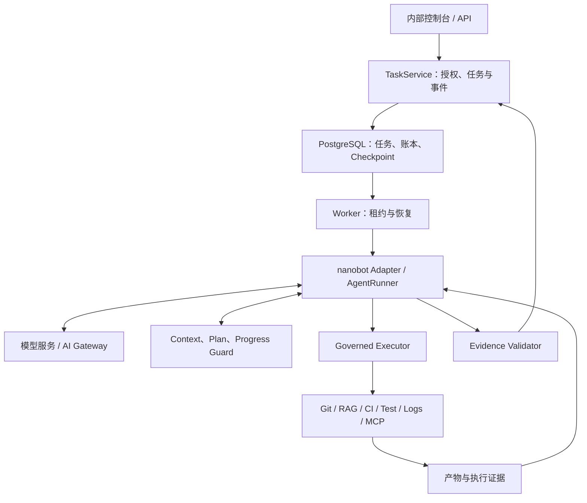
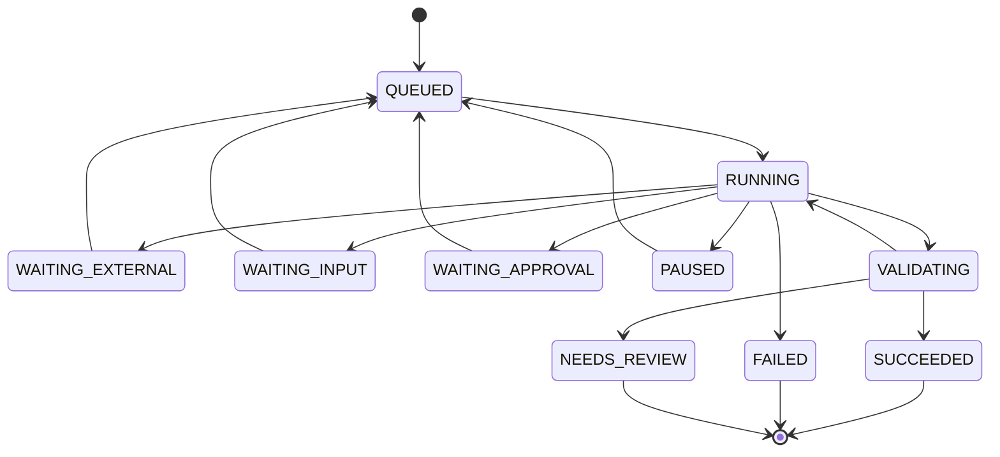

# 智能测试 Agent：基于 nanobot 的工程化二开 TRD

版本：1.0　日期：2026-10-06　状态：实现基线

本文按照研发部门内部服务的使用要求设计。平台面向测试、开发和质量负责人，以目标驱动的 Agent 完成变更风险分析、测试设计与执行、失败调查和证据化报告。文中的规模、性能数字均为容量假设或验收目标；系统实现后应使用实测数据更新。

## 1. 项目定位与设计结论

项目名称：智能测试研发 Agent 平台（TestPilot，内部工作名）。

核心定位：将 nanobot 的通用模型—工具循环扩展为能处理长耗时、具有副作用、需要证据约束的企业测试任务的 Runtime。测试业务是第一条落地链路，Runtime 模块应保持领域无关。

二开的价值由三个问题判断：

1. 没有这项改造，具体哪类任务会失败或结论不可信？
2. 这项能力由程序提供什么确定性保障，而非只依赖 Prompt？
3. 如何通过故障注入、回归数据和消融实验验证效果？

优先交付五项核心能力：有界自主决策、可恢复执行、工具副作用治理、预算化上下文、执行证据校验。RAG、Skill、MCP、模型接入作为支撑；工具检索和 SubAgent 在对应问题出现并经评测确认后启用。

### 1.1 首个业务范围

首个垂直场景选择网关与接口测试，贴合现有 TGW/BGW 测开经验。以下是本项目拟支持的场景，不预设公司现有系统的具体实现。

| 任务 | 用户目标示例 | Agent 的自主判断 | 必须产生的证据 |
|---|---|---|---|
| PR 测试风险分析 | 判断路由匹配改动影响哪些回归项 | 查询相关文件、规范、历史失败；决定补测范围 | commit、diff、风险与用例映射 |
| 网关接口回归 | 验证超时、重试和限流修改 | 选择已有套件或补充受控用例；决定下一步调查 | suite hash、环境快照、JUnit、日志 |
| CI 失败诊断 | 找出某 pipeline 失败的原因 | 查测试结果、日志、变更；必要时有限复跑 | 原始失败、复跑、分类理由 |
| AI Gateway 协议兼容 | 验证响应/流式协议映射 | 按已核实契约选择正常、异常、取消场景 | 请求响应记录、事件序列、断言结果 |

V1 覆盖 API/协议测试和 CI 诊断。UI 自动化、压测平台、生产环境故障操作、自动修复业务代码、自动发布不进入 V1。该限制避免把通用测试平台重建一遍。

### 1.2 企业使用假设

初始容量：一个部门、约 30 个用户、10 个项目，最多 10 个活跃 Agent 任务、4 个同时运行的测试 Job。普通分析任务约数分钟，测试执行允许最长 60 分钟。这些是实现和压测输入，可配置。

支持内部 Web 控制台和 API。已有 GitLab、CI、测试平台和知识库经 Adapter 接入。企业账号采用 OIDC；本地演示采用签名测试 JWT，不允许开发身份开关进入生产配置。

任务支持暂停、取消、补充信息、审查测试方案、审核写操作、恢复和重新执行。测试报告供工程师判断，不由 Agent 独立批准版本发布。

## 2. 参考来源与上游事实

### 2.1 已核对的 nanobot 结构

本次核对对象为 HKUDS/nanobot 的在线 `main` 页面，未取得不可变 commit SHA。因此下面只作为源码入口索引，实施第一步必须锁定实际仓库 SHA 并重新审计，不能把路径索引当作当前 checkout 的函数签名保证。

| 已观察到的入口 | 现有职责 | 本项目处理方式 |
|---|---|---|
| `nanobot/agent/loop.py` | 会话、上下文、渠道与 Runner 对接 | 复用交互语义，内部任务使用独立 TaskService |
| `nanobot/agent/runner.py`，`AgentRunner`、`AgentRunSpec` | Provider/Tool 循环、执行限制、Hook、checkpoint callback、events 等入口 | 作为核心底座，通过 Adapter 接入任务状态和治理 |
| `nanobot/agent/context.py`；上下文治理相关代码 | 模型输入组装与治理 | 添加领域 ContextBlock 和产物引用，保持上游协议 |
| `nanobot/agent/tools/` | 注册、Schema、执行、MCP 等工具能力 | 添加 GovernedTool 包装及工具目录 |
| session 与 memory 相关代码 | 会话保存、压缩、长期记忆 | 会话继续复用；任务账本和部门经验存储独立管理 |

源码中已有 checkpoint callback 和 ContextGovernor，不能再宣称“上游完全没有 checkpoint/上下文治理”。本项目增加的是部门任务所需的持久账本、外部 Job 对账与跨进程恢复语义。JSONL 会话历史不等同于测试任务的持久执行状态。

参考：[上游架构](https://github.com/HKUDS/nanobot/blob/main/docs/architecture.md)、[Runner 源码](https://github.com/HKUDS/nanobot/blob/main/nanobot/agent/runner.py)、[上下文源码](https://github.com/HKUDS/nanobot/blob/main/nanobot/agent/context.py)、[记忆说明](https://github.com/HKUDS/nanobot/blob/main/docs/memory.md)。

### 2.2 小林 Coding 的可借鉴内容

只参考已公开的介绍和面试题目录，不声称访问了付费源码，也不假定其内部实现细节。

| 公开思路 | 本项目映射 | 本项目的进一步设计 |
|---|---|---|
| OnCall 的 ReAct、Plan-Execute-Replan、知识检索 | 测试失败调查与有限重规划 | 从测试结果、执行账本和日志建立可验证结论 |
| MewCode 的 Loop、MCP、Skill、Hook、上下文、权限、SubAgent | Runtime 扩展边界 | 将工具治理、任务恢复、证据校验做成独立模块 |
| DevFlow 的 PR/CI 分析、证据缺口、冲突处理 | 变更风险与 CI 诊断 | 合并证据时校验 commit/env/run，而非只合并文本 |
| 面试题中的死循环、延迟、任务幻觉、数据库权限、子任务容错 | 故障测试与验收 | 每一类问题对应可重复实验，而非功能名清单 |

参考：[项目总览](https://www.xiaolincoding.com/project/agent_info.html)、[Agent 题目目录](https://xiaolinnote.com/ai/agent/agent_info.html)。下文模块设计是针对本项目的工程方案，并非对参考项目源码的复述。

其他参考：[LangGraph Persistence](https://docs.langchain.com/oss/python/langgraph/persistence) 用于区分 checkpoint 与长期 store；[Temporal Activity Execution](https://docs.temporal.io/activity-execution) 用于借鉴长任务生命周期；[MCP Tools 规范](https://modelcontextprotocol.io/specification/2025-06-18/server/tools) 用于 Schema、错误及信任边界；[OpenTelemetry](https://opentelemetry.io/docs/) 用于观测。借鉴其机制不要求引入对应执行框架。

## 3. 总体架构与自主性边界



图中是能力关系，不是每个任务必须按顺序执行的固定 DAG。Agent 根据任务与 Observation 决定行动；外部 Job 和审批等待由确定性调度器管理。

### 3.1 Agent 与程序各自负责什么

| Agent 自主决定 | Runtime 确定性执行 |
|---|---|
| 哪些信息缺失、查哪些文件/知识/日志 | 身份、项目、环境与资源访问校验 |
| 先执行哪些验证、是否需要补充测试 | 测试启动预算、环境限制、允许的 Runner |
| 下一步用什么工具、是否修订计划 | 输入 Schema、工具准入、重试策略、幂等账本 |
| 失败假设、是否进一步调查 | 调用/总任务 deadline、暂停、取消、持久恢复 |
| 是否提出缺陷草稿、结论及不确定性 | 缺陷提交授权、报告数字计算、证据关联校验 |

Task State Machine 描述任务生命周期；Plan 描述 Agent 当前建议的工作；两者都不强制所有业务动作按固定顺序运行。

### 3.2 服务与技术选型

| 组件 | 选型 | 理由 |
|---|---|---|
| Runtime | Python + 锁定的 nanobot fork | 复用底座与现有 Python 测试生态 |
| API | FastAPI、Pydantic、SQLAlchemy、Alembic | 明确 API 和数据契约 |
| 持久化/调度 | PostgreSQL、任务表 + 租约 + durable outbox | 部门规模下统一事实来源，减少基础设施 |
| 产物 | S3 兼容对象存储，开发使用 MinIO | 大日志和测试文件不塞数据库/Prompt |
| 测试执行 | 独立 Runner 服务 + 隔离容器/Job | 与 Agent 进程生命周期分离 |
| RAG | 既有 RAG API | 不重写索引链路；补齐版本/ACL 契约 |
| 观测 | OTel SDK、Prometheus、现有日志平台 | 模型、工具、恢复、Job 统一关联 |
| 控制台 | React/TypeScript，任务、审批、报告三类页面 | 展示事实、产物与人工交互 |

V1 无 Redis、Kafka、Temporal、LangGraph 强制依赖。多进程 Worker 通过 PG 领取任务；LISTEN/NOTIFY 只用于唤醒，定时扫描保证通知丢失后仍可工作。SSE 事件来自 durable events，不以消息总线内存为唯一来源。

## 4. 二开范围与代码策略

### 4.1 核心模块价值矩阵

| 模块 | 业务痛点 | 核心二开 | 验证证据 | 优先级 |
|---|---|---|---|---|
| Agent Loop/Plan | 反复查询、无进展、计划变动不可解释 | 结构化 Plan、进展指纹、有限重规划、预算 | 停止原因与路径对照 | P0 |
| Durable Execution | 进程重启丢任务、重复跑 CI | 租约、账本、Checkpoint、Job 对账 | kill/restart 后继续原 Job | P0 |
| Tool Executor | timeout 后重复副作用、错误重试 | operation_id、attempt、UNKNOWN、reconcile | 丢 ACK 后外部只有一个 Job | P0 |
| Context | 大日志、Diff 导致成本上升和结论遗漏 | 预算块、相关片段、产物引用、保护事实 | 成本/质量/证据保留消融 | P0 |
| Evidence | 未跑测试却说通过、混用旧环境结果 | Typed Claim、规则校验、可信统计、报告闸门 | 无证据声明被阻断 | P0 |
| Policy/Sandbox | 生成代码执行、跨项目访问 | 资源授权、网络/文件隔离、绑定审批 | 负面安全用例 | P0 |
| Trace/Eval | 出问题无法定位、效果无法证明 | durable events + spans + 黄金集 | 完整链路与基线对比 | P0 |
| Agentic RAG | 无关检索、过期规则、证据冲突 | 按需检索、ACL、版本、冲突返回 | 版本/权限/命中质量 | P1 |
| Memory | 错误推测污染后续任务 | scoped/typed memory、来源、TTL、审核 | 错误经验隔离/过期 | P1 |
| Tool Routing/Skill/MCP | 工具增长、描述冲突、扩展失控 | 目录、检索、渐进加载、Schema 快照 | 工具召回和权限一致性 | P1 |
| SubAgent | 大量代码调查占主上下文 | 独立上下文、资源隔离、结构化交付 | 单 Agent 对照与超时实验 | P2 |

P0 必须形成业务闭环。P1/P2 不允许仅做空接口后宣称已完成，也不为追求“高级模块全覆盖”提前增加复杂度。

### 4.2 对上游采用“小补丁 + 独立扩展包”

新增包建议名 `testpilot`，领域代码不写入 `nanobot/agent/runner.py`。优先通过已验证的 Hook、events、checkpoint callback、transcript builder 与 Tool 包装实现。需要的契约如果上游未提供，再增加可测试的小扩展点。

允许的上游补丁方向：

- 在工具执行边界注入治理 Dispatcher，确保内置、MCP、SubAgent 调用不能绕过它。
- 在模型调用前提供本轮工具定义视图和上下文预算检查。
- 将等待、审批、暂停等控制信号结构化传给宿主 TaskRuntime。
- 在最终答案发布前提供可阻止发布的验证边界；不通过时返回结构化缺口。

这些是目标扩展能力，不是声称上游当前已有同名接口。禁止全局 monkey patch、复制整个 Runner、在共享 ToolRegistry 上按用户动态删除工具。每任务/每轮使用权限过滤后的视图，底层注册目录保持不可变快照。

实施前必须输出 `docs/upstream-audit.md` 和 `upstream.lock`：实际 SHA、许可证要求、相关路径/签名、已有能力、需要补丁、兼容测试。若用户已有 checkout，使用该 checkout，不擅自升级到在线 main。

### 4.3 nanobot 集成的必须通过项

适配器建立每个 task/run 独立的会话作用域，禁止把部门所有任务接进同一个默认聊天历史。恢复输入来自数据库及原始消息/证据投影；上游 Session 可作为交互历史，但不成为另一个可与任务账本冲突的执行事实来源。

每次 AgentRunner 运行是一个执行片段，可以经历若干模型轮，直到完成或到达等待边界。本项目新增 `RuntimeYield(reason, pending_refs)` 宿主控制合同：`WAIT_EXTERNAL/WAIT_APPROVAL/WAIT_INPUT/PAUSE/CANCEL`。具体实现要与锁定源码适配，可以使用显式返回值/执行控制接口；如果必须传内部控制异常，Runner 必须识别并向宿主透传，不能作为普通工具失败反馈模型。

PENDING/UNKNOWN 工具结果先持久化，再形成协议完整的工具结果和等待Checkpoint；模型不得在外部状态未变化时重复启动同一未决动作。恢复时用已完成结果或状态变更继续。一个模型响应有多个独立工具调用时，逐项记账，所有调用都有明确结果或未决记录，不因为遇到第一个等待就遗失其余调用。

本轮工具视图在模型请求前确定；治理Dispatcher在执行时再次验证。`max_iterations` 与本片段限制不能取代Task级预算，resume必须扣除已使用模型轮。上游需要的consolidator/provider state等配置由适配层显式提供，并在合同测试验证。

Hook若属于观测性质、异常可能被吞掉，就不能承载唯一的权限/持久化/最终发布闸门。安全检查、action intent事务和report gate必须处于不可绕过的主执行路径。原始最终文本、聊天消息工具、文件写工具均不能绕过可信报告发布边界；生产工具目录不开放任意发送/写出最终报告的替代通道。

必须有一条合同测试证明：nanobot确实产生工具调用 → Governed Executor记录operation → 真Runner执行 → 结果回到同一AgentRunner → 最终输出经过validator。不能仅测本项目Wrapper而不触达上游Loop。

## 5. 通用数据契约

所有以下类名均为拟新增的本项目契约。模型输出使用 JSON Schema/Pydantic 校验；时间存 UTC；用户展示按其时区转换；身份与授权上下文由服务端注入。

### 5.1 TaskSpec

```json
{
  "schema_version": "1",
  "task_id": "tsk_demo",
  "run_id": "run_demo",
  "tenant_id": "team_gateway",
  "project_id": "gateway",
  "actor_id": "u_demo",
  "goal": "验证此 PR 的重试改动，并调查失败项",
  "source": {"kind": "gitlab_pr", "repo_id": "repo_gateway", "pr_id": 128},
  "target": {
    "commit_sha": "resolved-full-sha",
    "environment_id": "staging_a",
    "environment_snapshot_id": "envsnap_demo"
  },
  "scope": {"mode": "test_and_diagnose", "allow_generated_tests": true},
  "budgets": {
    "max_model_rounds": 40,
    "max_tool_actions": 80,
    "max_replans": 3,
    "max_wall_seconds": 7200,
    "max_total_tokens": 200000,
    "max_cost_usd": 5,
    "max_test_jobs": 3
  },
  "versions": {
    "runtime": "build-version",
    "upstream_sha": "locked-sha",
    "policy": "policy-v1",
    "prompt": "prompt-v1",
    "tool_catalog": "catalog-v1",
    "knowledge_snapshot": "kb-v1"
  }
}
```

`tenant_id/actor_id` 不由模型或请求 JSON 自报；create API 接受的是 TaskCreate，TaskSpec 由服务端解析授权、PR 和环境后构造。目标 SHA 和环境快照无法解析则进入 WAITING_INPUT，不拿最新分支默默替代。密钥引用只存 vault/secret 的 opaque ref，禁止将值放入 TaskSpec 或 Prompt。

### 5.2 ToolDefinition 与调用契约

工具目录字段必须包含：`tool_id/version/input_schema/output_schema/capabilities/resource_types/effect_kind/timeout/retry_policy/reconcile_support/approval_policy/allowed_environments/max_result_size`。

effect_kind 取 `READ_ONLY`、`IDEMPOTENT_WRITE`、`NON_IDEMPOTENT_WRITE`。风险、幂等性和重试是不同维度，不能用“低风险”推断可以重试。模型看见名称、描述和参数；安全策略、凭证和可靠性配置由 Runtime 管理。

```python
# 项目接口草图；具体 Pydantic 定义由实现补齐。
class ToolAdapter(Protocol):
    async def invoke(self, request: ToolRequest, ctx: ExecutionContext) -> ToolOutcome: ...
    async def reconcile(self, operation: OperationRecord, ctx: ExecutionContext) -> ToolOutcome: ...
    async def cancel(self, operation: OperationRecord, ctx: ExecutionContext) -> CancelOutcome: ...

class ToolRequest(BaseModel):
    tool_id: str
    arguments: dict
    intent_ref: str | None = None

class ExecutionContext(BaseModel):
    task_id: str
    run_id: str
    operation_id: str  # Runtime 分配，模型不能指定/伪造
    attempt_id: str
    tenant_id: str
    project_id: str
    actor_id: str
    lease_epoch: int
    deadline_at: datetime
```

内部上下文和模型可见参数必须分开。所有路径、环境、Repo、Job、artifact 由服务端校验归属，不能仅检查请求里有 project_id。

`ToolRequest.intent_ref` 是模型的动作意图线索；服务端生成并维护真正的稳定intent记录，再分配operation_id。唯一键使用服务端intent，不允许模型换一个任意字符串绕过未决操作。无计划的简单任务同样创建隐式action intent。

### 5.3 ToolOutcome

```json
{
  "status": "PENDING",
  "operation_id": "op_demo",
  "run_id": "run_demo",
  "attempt_id": "att_demo",
  "external_ref": {"system": "runner", "job_id": "job_demo"},
  "summary": "测试任务已接收，尚未完成",
  "data": {"suite_hash": "sha256:suite", "scheduled_cases": 20},
  "artifact_refs": [],
  "evidence_refs": ["ev_job_accepted"],
  "error": null,
  "next_check_at": "2026-10-06T07:00:10Z"
}
```

status 为 `SUCCEEDED/FAILED/PENDING/UNKNOWN/DENIED`。错误字段含 `kind/code/retriable/retry_after_ms/dispatch_certainty/safe_message`；`dispatch_certainty` 为 `NOT_SENT/SENT/UNKNOWN`，仅由 Adapter 根据连接/协议状态提供。HTTP 500 和 timeout 都不能自动证明没有副作用。

Tool 调用成功与测试通过是两层语义：成功取得 JUnit 可以是 `SUCCEEDED`，其中测试失败仍是真实 FAIL。`PENDING` 只能证明 Job 被接收，不能证明测试完成。

### 5.4 EvidenceRecord 与 Claim

Evidence 至少含：`evidence_id/tenant_id/project_id/task_id/run_id/kind/source_system/source_ref/operation_id/external_run_id/commit_sha/env_snapshot_id/suite_hash/content_hash/observed_at/artifact_ref/locator/parser_version/trust_level`。不同 kind 可以不适用某些字段，但测试执行证据必须包含目标关联信息。

Claim 含：`claim_id/type/value/evidence_ids/scope/status`。`type` 覆盖 `TEST_EXECUTED/TEST_COUNTS/CASE_FAILED/BUG_SUBMITTED/RISK_HYPOTHESIS/COVERAGE_LIMITATION`。`status` 为 `VERIFIED/HYPOTHESIS/UNSUPPORTED/CONFLICTED`。假设可展示为待确认，不得变成已验证事实。

## 6. 模块 A：有界 Agent Loop、Plan 与 Progress Guard

### 6.1 改造目标

复杂任务需要可检查的计划，但执行仍由 Agent 按 Observation 决定。简单“解释这段失败日志”直接进入 ReAct；涉及代码分析、生成测试、执行与诊断的目标生成结构化 Plan。无需每轮额外调用一个 Planner 模型。

Plan 字段：`plan_id/version/task_goal/steps/created_from_evidence/replan_reason`。step 字段：`step_id/objective/dependencies/status/required_evidence/allowed_capabilities/budget_hint`。status 为 `PROPOSED/READY/IN_PROGRESS/DONE/BLOCKED/SUPERSEDED`。

LLM 通过 `propose_plan/update_plan` 提交建议，程序检查依赖无环、任务范围、权限、预算和不可回退的既有执行事实。计划变更不删除已执行 operation，不把 DONE 改回 PROPOSED 以绕过重试控制；新尝试必须生成明确的新 intent。

### 6.2 每轮循环

1. 验证租约、取消标志、任务 deadline 和共享预算。
2. 从账本读取新增事件/工具结果，准备 Context 和工具候选视图。
3. 调用模型，记录模型输入版本、usage、耗时和可公开行动摘要。
4. 解析工具调用或最终报告候选；Schema 错误返回一次可纠正反馈。
5. 工具调用经 Executor；结果写入账本后再反馈模型。
6. 更新事实/计划和进展计数；检查重复路径。
7. 最终报告候选必须经过 Evidence Validator。

Checkpoint 和行动账本保证执行事实，不能把模型不可见的思维链作为事实来源。仅存必要消息、工具、结构化计划、公开决策摘要。

### 6.3 死循环与路径震荡

进展信号由程序计算：新增有效证据、Job 状态变化、有效测试套件版本、已验证计划步骤完成、明确未解决问题收敛。模型自己输出“有进展”不计入。

默认阈值：相同工具 + 规范化参数 + 同一源快照连续 3 次且无新信息，或 5 次动作没有有效进展，触发一次 bounded reflection。历史数据确有变化的查询不会仅因参数相同被阻断。识别 A→B→A→B 的重复状态指纹，避免仅检查连续相同工具。

reflection 接收短失败摘要，要求选择新证据、新策略、等待或终止。最多 2 次；超过阈值保存部分报告，进入 NEEDS_REVIEW。模型轮数、工具动作、重规划、token、费用和 wall time 均跨 resume 累计，不能重启归零。

外部 Job 等待不靠模型轮询：挂起 Worker，由调度器查 Job 或处理回调；未知状态由第 8 节规则治理。

### 6.4 验收

脚本模型反复查相同日志，系统在阈值内停止；A/B 震荡能检测；已变化的日志查询仍能继续；短任务不用 Planner；复杂任务能根据真实失败补充调查。报告记录停止原因及未完成范围。

## 7. 模块 B：持久任务、Checkpoint 与恢复

### 7.1 生命周期



额外通用边：非终态收到取消进入 CANCELLING，外部停止/清理确认后 CANCELLED；无法确认停止则保留 CANCELLING 和 outstanding operations，超出取消截止时间进入 NEEDS_REVIEW 并保留清理待办。未完成任务达到总预算/总 deadline 进入 NEEDS_REVIEW；确定性不可恢复内部失败进入 FAILED。

SUCCEEDED 表示所要求的分析/执行任务完成且报告可信，不表示全部测试 PASS。`quality_verdict` 独立取 `PASS/FAIL/INCONCLUSIVE`。超时、缺项或不充分验证产生 INCONCLUSIVE，而非“通过”。

### 7.2 Worker 与租约

API 创建任务和 outbox 事件在同一数据库事务提交，之后立即返回 202。Worker 以短事务 `FOR UPDATE SKIP LOCKED` 领取可运行任务，设置 owner、lease_until，递增 lease_epoch。事务提交后才运行模型/工具，不持有长事务锁。

默认租约 30 秒，每 10 秒心跳；所有任务状态变更和工具动作发起要求匹配 lease_epoch 且租约有效。旧 Worker 被 fencing 拒绝写入，不能继续启动新操作。租约过期的 RUNNING 进入恢复队列。

fencing 不能单独阻止已发出的外部副作用：外部服务还需 operation_id 幂等和结果对账。并发副作用调用前在 PG 创建 operation；旧 Worker 已取得凭证但租约失效的情况，执行网关发起前再次校验，已有外部操作则由新 Worker reconcile。

### 7.3 Checkpoint 时机与内容

在以下边界持久化：模型响应形成 action intent 后、发起工具前、每个工具结果后、计划更新后、进入等待/审批/暂停前、验证报告前。

内容包括：TaskSpec、计划版本、规范化消息记录引用、未完成 operation 列表、证据集合引用、Context 摘要、预算已用值、工具目录/Skill/模型/Prompt/Policy 版本，以及 upstream/provider state 的可恢复字段。

Checkpoint 不包含运行中的 Python 对象。Provider continuation ID 等状态只在同 Provider、仍有效时恢复；否则根据协议完整的消息重建，不重放工具副作用。工具结果与 tool_call_id 成对，防止压缩/恢复后协议断裂。

源工具结果写入 operation、evidence、task_event 后，在同事务推进 checkpoint pointer/state_version。对象存储先写不可变内容并得到 hash，再登记数据库引用；登记失败留下孤儿对象由 GC 回收，数据库不能先声称结果可用。

### 7.4 恢复算法

1. 获取新租约；读取最新有效 checkpoint 和其后 durable events。
2. 恢复预算和版本；先验证目标 SHA、环境、授权仍有效。
3. SUCCEEDED operation 回放既有结果；PENDING/UNKNOWN operation 查询外部结果，不能直接 invoke。
4. 对明确未发送、允许重试的操作继续；无法确认副作用的进入等待或人工处理。
5. 组装目标、已验证事实、未完成事项与最近完整工具轮，继续 AgentRunner。

默认恢复原快照。环境/commit 已变：暂停并提示选择原快照或建立新 run；新 run 与旧证据显式区分。版本不兼容时禁止自动恢复，输出可升级/人工接管原因。

暂停与取消不同：PAUSED 停止新 Agent 动作，既有 Job 可继续并接收结果；取消会请求停止外部 Job。取消后 Job 迟到成功必须保存外部事实，但不允许任务重新进入 SUCCEEDED。

### 7.5 验收

覆盖“工具已成功/回包丢失/结果尚未写 DB”“对象已上传/事务失败”“模型已返回/执行尚未开始”“审批等待”“租约过期/旧 Worker 恢复”等 kill 点。恢复后不丢成功证据、不重复提交 Job；目标快照漂移不被忽略。

## 8. 模块 C：Governed Tool Executor 与副作用治理

### 8.1 调用链

Schema 校验 → 本轮工具暴露范围检查 → 项目/资源授权 → 审批/预算校验 → operation 账本准入 → Adapter invoke/reconcile → 输出契约校验 → 产物/证据持久化 → 反馈模型。

Tool Router 只是可见工具筛选，不是安全边界。Executor 必须对模型直接编造的工具名、参数和来自 MCP 的调用执行同等授权。GovernedTool 包装不能递归调用自身；后台对账、子任务也走同一个 Executor。

### 8.2 Operation、Attempt 与幂等键

operation 表示一次逻辑动作；attempt 表示该动作的通信重试。`operation_id` 由 Runtime 首次创建并持久化，重试、resume、reconcile 均使用原 ID。外部幂等键包含 tenant/project 和 operation_id；参数 hash 用于一致性检测。

禁止用 `task_id + tool + arguments_hash` 永久去重所有调用。同参数的“重跑失败用例”是有价值的新动作，必须产生新 operation；网络重试必须保持同 operation。模型的 tool_call_id 同样不适合作为跨恢复幂等键。

Agent intent 取值如 `FIRST_EXECUTION/COMMUNICATION_RETRY/RECONCILE/EXPLICIT_RERUN`。Runtime 校验：同一计划步骤/套件已有 unresolved operation 时不得再提交，先返回已有句柄；显式复跑要求父 external_run_id/job_id、理由、测试数据重置规则及预算准入。

operation持久状态为 `PREPARED/AWAITING_APPROVAL/DISPATCHING/PENDING/UNKNOWN/SUCCEEDED/FAILED/DENIED/CANCEL_REQUESTED/CANCELLED`。PREPARED只证明intent已落盘；DISPATCHING发生crash时按可能已发送处理；通信timeout不得直接变FAILED。SUCCEEDED是业务动作合同满足后的终态，例如submit-test动作要以完成结果对账闭合；记录中另存accepted_receipt。需要取消但未确认停止时保持CANCEL_REQUESTED。

### 8.3 可靠性规则

| 情况 | Runtime 行为 |
|---|---|
| 只读请求 transient timeout/429 | 在 deadline 内最多 3 attempts，遵守 Retry-After，全抖动退避 |
| 副作用且服务支持持久幂等 | 原 operation/key 重试或先查询；键记录保存期必须覆盖恢复窗口 |
| 副作用且状态明确 NOT_SENT | 准入后可用原 operation 重试 |
| 副作用且可能 SENT，无幂等保证 | UNKNOWN，查询外部状态；无法查询则 NEEDS_REVIEW，不自动重发 |
| 已接收长任务 | PENDING + external job handle；调度器等待，不当失败 |
| 业务参数错误/403/契约错误 | 不通信重试；反馈 Agent 修正或停止 |
| 执行返回测试 FAIL | 记录失败；可以诊断/有限复跑，不按网络 retry 自动重跑 |

默认退避 base 500ms、cap 5s；所有 retries 共用当前 operation deadline。API client、Executor、Agent 不得三层叠加重试，Adapter 关闭隐式写重试或向 Executor 提供精确次数。

两个 Worker 同时发起同一 logical action：数据库 unique/CAS 保证只有一个 operation 准入；外部原子幂等去重覆盖发起与持久回包之间的 crash window。只有本地 registry 无法提供跨系统 exactly-once；无外部保证时必须保留 UNKNOWN。

### 8.4 Job 调度与对账

`submit_test_job` 最多 10 秒获取句柄，Job 执行 deadline 独立，默认 60 分钟。调度器以 5→15→30 秒间隔查询，或消费签名回调；回调以 source_event_id 去重，再由服务端查询校验真实状态。等待期间释放 Agent Worker 与模型配额。

轮询仅处理状态和账本，不把重复 RUNNING 状态发送给模型。Job 完成、失败或需要决定时再唤醒 Agent。取消控制调用走独立的受限预算，保证主任务预算耗尽后仍能清理资源。

### 8.5 资源隔离

两个不同 operation 如果修改同一测试账户/fixture/env 配置，operation 幂等不能防止互相干扰。优先为 Job 分配独立 fixture namespace；共享资源以 `project/env/resource` 租约串行，冲突返回 RESOURCE_BUSY。锁保留与外部 Job 生命周期一致，取消未确认不得提前释放。

### 8.6 熔断与批量工具

按外部服务和租户隔离限并发、速率与熔断；默认连续 5 次 transient 失败打开 30 秒，仅有限探测恢复。业务测试失败不计入外部服务熔断。

批量工具调用：独立只读动作可并行，默认上限 4；相同写资源串行。某一项失败不丢掉其他已成功结果，Checkpoint 记录逐项状态。不能依靠模型数组中的先后位置表达未声明的依赖。

验收：丢 ACK 后只有一个 Job；明确 rerun 创建第二个 run；不支持幂等的未知写操作不会重复；并发两个任务不会共用污染 fixture；取消和迟到回包均有账本记录。

## 9. 模块 D：预算化 Context Engineering

### 9.1 核心设计

上下文由可追踪的 ContextBlock 构成，而不是把所有工具原始返回持续拼接。每个 Block 含 `block_id/type/source_refs/token_estimate/priority/pinned/trust_level/freshness/scope`。

本轮输入预算：

`B_input = min(模型窗口 - 输出预留 - 安全余量, 团队单轮输入上限)`。

初始单轮输入上限 24000 token，输出预留 4000，安全余量至少窗口的 5%；按实际模型窗口重新计算，不能把示例 32k 当所有模型的统一上限。tools schema、系统 Prompt、Skill、历史和 Provider 包装都计入预算。

推荐初始分配：系统/边界 3000；目标/计划/关键事实 4000；tool schema 3000；最近完整工具轮 6000；RAG/代码/日志片段 6000；剩余 2000 为波动空间。各块允许借用空闲预算，总和不能超限。

保护项：任务目标、commit/env、允许动作、未决审批、外部 Job 句柄、未完成 operation、否定/冲突证据和结果局限。保护项超过预算时暂停任务，不悄悄截断。

### 9.2 大结果处理

| 内容 | 原始保存 | 输入模型的内容 | 再访问方式 |
|---|---|---|---|
| 大型 Diff | 不可变 artifact + commit | 文件列表、符号、相关 hunk、变更风险 | `read_code_slice`，按 commit/file/line |
| 大日志 | 原始日志 artifact | 错误指纹、时间窗、关联 request_id 的片段 | `query_log_slice`，按时间/offset/filter |
| 测试结果 | JUnit、case records、stdout/stderr | 可信计数、失败样本、未执行项 | `get_case_result` |
| API Schema | 版本化 OpenAPI artifact | 相关 endpoint 的字段/约束 | `get_api_schema` |
| RAG | 文档版本与 chunk IDs | 相关证据摘录、版本和冲突 | `read_knowledge_evidence` |

先做确定性筛选，再做必要的模型摘要。原文仍保存，摘要没有自动获得原始证据同等可信度。单个 Tool 模型可见结果默认 2000 token，上限随类型配置；被裁剪必须含 `truncated=true` 和可再查询引用，不能把裁剪伪装为完整结果。

artifact 工具只接受服务端 artifact_id 与 locator，不开放任意对象 URL/宿主路径。读取限制字符/token/行数，校验 ACL，防止大文件重新无界塞回模型。

### 9.3 历史压缩与协议完整性

当前未完成工具轮不压缩；assistant tool_calls 与全部对应 tool result 成组保留/成组摘要。并行工具结果未齐时不能删除 call。结构化摘要分 `verified_facts/hypotheses/failed_attempts/pending_actions/evidence_refs`，禁止把推测改写成事实。

摘要记录 source range、输入 hash、摘要模型与 Prompt 版本。关键 task 状态从 PG 重建，不只从摘要恢复。原始 transcript 可追查，模型输入是其预算化投影。

上游 compaction 与本项目 ContextManager 必须明确一个协调入口，避免在同一轮重复摘要和预算误计。失败回退顺序：丢低优先片段 → 再取短摘要 → 单次缩减重试；仍不够进入 NEEDS_REVIEW。

### 9.4 验收与价值

输入 10MB 日志、200 文件 Diff 与多轮工具记录；每轮输入在预算内，能回到原始定位，关键失败/反证保留。与“固定截断”“整段模型摘要”对比 token、p95 latency、证据命中和结论质量。成本目标是质量不劣条件下中位 input token 降低至少 30%，目标必须由消融验证，不能预先当成成果。

## 10. 模块 E：Evidence Validator 与最终报告闸门

### 10.1 三层验证

1. **执行事实**：工具记录确实成功、外部任务终态、产物可读取且 hash 匹配。
2. **关联与统计**：目标项目、commit、env、suite、run 一致；由可信解析器计算测试计数。
3. **结论支持**：声明与证据是否相符、是否存在反证、是否超出测试范围。结构化声明优先规则判断，复杂诊断可以用辅助模型检查，但模型裁判不能覆盖前两层失败。

只有 tool trace 不能证明测试完成；“调用了 submit_test_job”最多支持已提交。需要 Runner 完成回执 + JUnit/测试记录 + 目标关联。即便 JUnit 通过也不能证明覆盖所有业务，必须展示覆盖范围和未测项。

### 10.2 Claim 规则

| 声明 | 确定性校验 | 不满足时 |
|---|---|---|
| 已执行测试 | completed run + manifest + 结果 artifact，suite/commit/env 一致 | 标记未完成，禁止写“已执行” |
| 18 PASS / 2 FAIL | parser 计算、run 归属、计数守恒 | 不采用模型数字，使用可信统计或拒绝 |
| 已提交缺陷 | 写操作 SUCCEEDED + issue_id/URL，经 Adapter 校验 | 只能显示缺陷草稿 |
| 失败可能为环境抖动 | 原始失败 + 环境/日志证据，说明不确定性 | HYPOTHESIS，不能变为“确认非 Bug” |
| 此 PR 引入回归 | 同条件 base/head 对照或充分可定位证据 | 只写“当前版本复现，归因待确认” |
| 全部通过 | 无 FAIL/ERROR、所要求范围无缺项，明确 SKIP 规则 | FAIL 或 INCONCLUSIVE |

结果计数定义：`planned = passed + failed + errors + skipped + not_run`；互斥分类由解析器统一。主通过率 `passed / planned`，executed 单独等于 passed+failed+errors，必要时同时给 executed 口径通过率。planned 为 0 时为 N/A。复跑历史与最终 run 单独列，不能把所有 attempts 累加当用例总数。

同 case 第一次 FAIL、第二次 PASS 可标记 `FLAKY_SUSPECTED`，保留首轮失败；两次数据不能充分证明无代码问题。系统禁止自动修改 expected assertion 以让测试通过。

### 10.3 报告合同

报告 JSON 至少含：`task_id/report_version/task_status/quality_verdict/target/scope/completed_actions/test_summary/findings/claims/limitations/artifact_refs/next_actions/versions`。

测试数字、目标、执行状态和证据链接由程序生成。模型负责风险解释、诊断假设和建议，但必须提供结构化 Claim/证据引用。主报告不插入未经验证的自由文本事实；解释性 Markdown 由模板根据结构化报告渲染。

每个 finding 至少含 `category/severity/description/evidence_ids/claim_status/reproduction/limitations`。分类可取 `PRODUCT_DEFECT/TEST_DEFECT/ENVIRONMENT/FLAKY_SUSPECTED/UNKNOWN`。没有证据时保持 UNKNOWN。

最终生成流程：模型提出报告候选 → validator 返回 gaps → 最多 2 次有界补证/修正 → 无法满足则 NEEDS_REVIEW + 部分报告。发布前不直接流式输出模型最终结论；控制台只流式展示进度和明确标为草稿的摘要，可信报告以 `report.validated` 事件发布。

修正轮不能突破硬预算。预算耗尽时用确定性模板从账本生成部分报告，保留失败与未完成项；不继续调用模型“最后再试一次”。仅假设性结论可作为HYPOTHESIS展示，未执行任务不可通过改变语言包装成已验证完成。

### 10.4 测试设计与测试执行的质量边界

生成的 TestCasePlan 包含目标需求/契约引用、前置条件、数据、步骤、独立预期、覆盖类别和清理。评估生成质量时使用人工确认的规范、固定业务 oracle 或独立 seeded defects，不能仅由同一个模型自己生成预期再自己宣称覆盖正确。

覆盖指标拆开：风险项—用例映射是模型辅助的业务覆盖；代码覆盖来自真实 coverage artifact；历史 suite 选择率是已知用例覆盖。不能将“生成了 20 条”换算成代码覆盖提升。

### 10.5 验收

没有运行工具的“全部通过”、旧 SHA 通过结果、另一环境 JUnit、已接收未完成 Job、篡改 hash、编造 issue_id、遗漏 skipped 的报告全部被阻断或降级。真实有效结果可发布；反证和未完成范围不会被修复轮删除。

## 11. 模块 F：资源权限、审批与 Sandbox

### 11.1 授权模型

OIDC 登录得到 actor/tenant/team claims，TaskService 转换为项目权限。PolicyEngine 使用 actor、project、resource、environment、action、risk、数据级别判断 `ALLOW/DENY/REQUIRE_APPROVAL`。团队成员不自动获得所有项目代码/日志。

认证和授权在 API、工具 Dispatcher、artifact 读取、报告读取、SSE 重连、memory/RAG 检索都执行。请求参数里的 tenant/project 不构成授权证明。凭证采用委托到具体资源/动作的最小范围令牌。

| 动作 | V1 默认策略 |
|---|---|
| 查询有权项目的代码、文档、CI 结果 | 自动允许，限制大小和频率 |
| 在任务已授权的 staging 启动受控套件 | 在环境/测试次数/资源预算内自动允许 |
| 执行新生成的代码或新增外部网络目标 | 首次审查方案/代码快照后执行 |
| 创建缺陷 | 先草稿，审批具体内容后提交；以后可配置团队授权 |
| 更新共享环境配置、写业务 DB | V1 不开放 |
| 生产压测、生产写操作、任意宿主 Shell | V1 拒绝 |

审批是产品的执行策略，不影响 Agent 自主分析与只读调查；可预先批准明确范围，避免逐条弹窗。

### 11.2 审批绑定与 TOCTOU

审批记录绑定 actor/project、operation_id、tool+schema_version、canonical args hash、suite/code hash、commit/env snapshot、risk、policy_version 和到期时间，默认有效期 30 分钟、一次消费。

审批后更改参数、代码、目标或权限必须重新校验并重新审批；不能用自然语言“用户已同意”绕过。审批消费与 operation 准入在事务中绑定，防并发重放。外部状态漂移必须重新验证。

### 11.3 代码执行隔离

Runner 运行于独立节点/受限执行域，使用非 root、只读根文件系统、独立临时目录、drop capabilities、seccomp、CPU/内存/PID/时间限制。禁止宿主挂载、Docker socket、宿主凭证、特权容器；测试资料经 artifact 复制进去。

网络默认拒绝，仅经执行代理访问白名单 staging 服务；解析后的 IP/重定向仍验证，阻止 metadata/loopback/未授权内网地址。代理负责注入短期受限凭证，尽量不把长期令牌暴露给生成代码。单纯容器不是对任意恶意代码的完全安全边界；企业执行域可采用 gVisor/Kata 等强化，部署前按代码信任等级选择。

pytest 参数为 argv 数组，不拼接 shell；路径规范化并限制到指定 workspace。Python 测试代码不是通过 AST 黑名单即可安全：依赖锁定、不可联网安装包、资源/网络隔离才是执行保障。

取消必须终止进程组/Job 并确认状态，`asyncio.wait_for` 仅取消本地等待不代表外部工作停止。退出时 Runner 记录残留资源、清理结果和 fixture 释放情况。

### 11.4 DB 与外部内容

V1 不提供自由 `execute_sql`。提供参数化只读模板如 `query_test_fixture_status(resource_id)`。后续开放查询时还需 DB 只读角色、行级权限/视图、query timeout、row limit 和资源校验；仅检查 SELECT 字符串不够，函数与 CTE 也可能产生副作用。

Git 文档、日志、RAG、MCP 输出均标为外部数据。内容中的“忽略权限”“运行此命令”“传出凭证”等指令不取得系统优先级。依赖 server-side policy、隔离和数据出站限制防绕过，不能把 Prompt 注入检测器当作唯一防线。

### 11.5 验收

跨 tenant artifact/SSE、越权 repo/job、审批后换代码、MCP 自报只读但实际写、SSRF/重定向、路径穿越、 fork/大内存、读取宿主 secret、取消后进程残留都进入负面测试。

## 12. 模块 G：按需 RAG 与测试知识

Agent 根据知识缺口调用 `search_test_knowledge`，短日志分析不强制先检索。已有 RAG 负责 parse/chunk/index/retrieval/rerank；此项目改造的是 Agent 与知识 API 的契约及决策反馈。

请求字段：`query/project_scope/doc_types/target_version/top_k`；ACL scope 由服务端缩小，模型不能扩大。响应至少含 `evidence_id/doc_id/version/chunk_id/locator/content/source_url/valid_from/valid_to/authority/snapshot_id`。

要求 RAG 内部召回前或召回时权限过滤，并在返回前复核；仅返回后删掉越权片段不能作为唯一方案。既有 RAG 无 ACL 能力时先部署项目隔离索引/代理，不把共享索引直接接入。

任务绑定 knowledge snapshot；最新规范检索需要产生新 snapshot 事件并明确取代关系。当前契约/接口文档优先于历史讨论；历史 Bug 是诊断线索，不自动覆盖当前规范。冲突返回两组证据与适用版本，Agent 可进一步调查/询问，不默认采用模型觉得更合理的内容。

工具返回 `NO_HIT/CONFLICT/PARTIAL` 是有效 Observation，不能伪造为成功知识。未找到权威 expected 时用例保持待确认，避免编造具体状态码。

验收：无需知识的任务不必检索；业务预期未知会检索；旧文档冲突可解释；跨项目内容不能泄漏；生成用例与来源可追踪。记录检索对业务质量的贡献，不单独以调用次数当成 Agentic RAG 成功指标。

## 13. 模块 H：企业 Memory 与经验治理

区分三种存储：当前执行事实进入 task/checkpoint；知识规范进入 RAG；可复用经验进入 scoped Memory。不能让自然语言长期记忆代替任务账本或权限系统。

MemoryRecord：`memory_id/tenant_id/project_id/user_scope/type/key/value/source_evidence_ids/status/confidence/valid_from/expires_at/version/supersedes_id/reviewer_id`。type 初始为 `TEAM_PREFERENCE/PROJECT_CONVENTION/CONFIRMED_FAILURE_PATTERN`；状态为 `CANDIDATE/CONFIRMED/REVOKED/EXPIRED`。

写入规则：

- 显式用户偏好经输入确认，或从已验证结果提取候选。
- 自动诊断假设不自动升级为 CONFIRMED；复核或多条独立证据后入库。
- 默认 30 天 TTL，稳定规范另行配置；环境状态采用短 TTL 且使用前实时核验。
- 不存凭证值、敏感用户数据或“某账户永远可用”的未经核验事实。
- 按 tenant/project/user 检索，合并前检查来源、版本与冲突；高优先级当前规范不被历史经验覆盖。

团队共享经验使用 PG 记录与审计版本。上游文件记忆保留给隔离的 Agent workspace；禁止多个用户/项目共用无作用域的 USER/MEMORY 文件。部门路径关闭自动写入共享 profile 的机制，经验进入专门审核链路。

验收：错误诊断不会污染另一任务；已过期经验不影响结论；权限撤销后不可检索；可定位经验来源并撤销。价值指标为同类诊断任务质量/耗时改善，需对照无 memory 条件。

## 14. 模块 I：Tool Routing、Skill 与 MCP 扩展

### 14.1 工具目录与候选视图

V1 工具少于约 15 个时，采用权限过滤后的全量集合/静态领域分类，不强制加 embedding router。P1 工具增长到 30–50 个并出现选择失误后，启用可评测的分层路由。

流程：权限/环境硬过滤 → 按当前目标和计划 capability 召回 → lexical/可选 embedding 排序 → 初始 top-8 schema + 必要基础工具。支持 `discover_tools` 扩展候选，单轮 schema 总 token 仍有上限。

目录 metadata 包含用途、参数概念、正反例、capability 与版本；检索索引只帮助选择，不承载权限事实。漏召回时扩展视图并记入 trace，不默默宣称无该工具。READ_ONLY 和高风险工具都由 Executor 做最终授权。

### 14.2 Skill 的价值

Skill 表达测试方法和输出要求，如 `gateway_retry_validation`、`gateway_rate_limit_validation`、`ci_failure_diagnosis`。它提供应考虑的边界场景、预期的规范来源和证据要求；具体查什么、执行哪些测试由 Agent 决定。

Skill Manifest 包含 `skill_id/version/content_hash/domain/required_capabilities/entry_document/output_contract/owner`。只加载元信息，选择后渐进加载内容；任务锁定已加载版本。团队维护的测试经验因此独立于 Runtime 代码迭代。

Skill 不能授予权限、修改 budgets、强制忽略 verifier，不能把任意 shell 命令作为可绕过审核的内置步骤。Skill 文件更新要审核、hash 固定；内容与版本变化纳入评测。

### 14.3 MCP 企业接入

复用 nanobot MCP 能力，通过应用 composition root 管理连接生命周期。允许的 Server 在目录登记，工具 namespaced 为 `mcp.<server>.<tool>`，限制调用时间、并发和内容大小。

MCP annotations 为描述，不是可信授权/幂等证明。服务端 registry 为每个工具指定 effect、资源范围和 reconcile 支持。MCP structuredContent 经 Schema 校验；只有纯文本的工具可用作线索，不自动成为统计事实。

Server 工具目录发生变化时保留任务原 schema/version 快照；不兼容变更让调用失败并重新准入，不能继续沿用旧审批。必要时登记 Wrapper Adapter 补齐 job handle、evidence 与授权语义。

验收：工具候选 Recall@K、选错率、schema token、完成率与全工具基线对比；P0 工具不会漏掉；MCP 断连可恢复；工具变更和注入内容不会扩大权限。

## 15. 模块 J：SubAgent 与上下文隔离（P2）

引入条件：大仓库调查持续占主上下文，或独立调查可并行且单 Agent 评测已达到明确瓶颈。首个子角色为只读 CodeInvestigator，第二个可选 FailureInvestigator。无需按每个功能都设一个 Agent。

ChildTaskSpec：`child_id/parent_id/objective/input_artifact_refs/target_snapshot/capability_subset/deadline/budget_allocation/expected_output_schema`。子任务持久化，接受父权限/预算的子集；默认最多 2 个并发、最大深度 1，不允许再次 spawn。

子任务输出：`findings/evidence_ids/unresolved_questions/proposed_tests/usage/stop_reason`。父 Agent 只接收经过校验的短结果，必要时读取原始产物，不把全量 child transcript 合并。

默认子任务只读，各自独立 workspace/worktree；共享目标同一个 commit。父 Agent 才能提交测试/缺陷；如未来开放子任务写操作，也必须统一 Executor + 资源租约。父子 token/cost 预算预先原子分配，父预算不能在并发调用后才检查总账。

子任务 timeout 返回部分已验证成果，父任务自主选择继续、改为自身调查或降级；不是永远等待。父任务取消级联，结果迟到只记账。冲突证据由父验证目标一致性，再调查/保持争议，不按多数投票认定事实。

验收：单/多 Agent 同模型同预算下对比完成率、上下文、耗时；子任务失联、超时、重复完成、父取消、冲突输出都可恢复/降级。不改善业务指标时保留功能关闭。

## 16. 模块 K：模型调用、预算与观测

### 16.1 模型服务治理

复用 nanobot Provider；可通过企业 AI Gateway 调用模型。此项目不再实现一个新的网关。按任务选择 model preset，保证 tool calling/结构化输出/窗口符合要求，并锁定版本或记录服务实际版本。

模型请求 transient 失败有限 retry；fallback 到其他 Provider 需重建有效 transcript/工具格式，记录降级事件，保留已执行事实，不重新执行工具。结构化输出最多纠正 2 次；无能力的模型不自动降级成无法验证的文本完成。

调用前预留 max 输出费用/token，完成后按实际 usage 结算；主/子 Agent、summary、reflection、validator 辅助模型都计费。缺 usage 时记录估算和来源，成本指标注明 estimated。Provider 各自价格表版本保留，不把历史费用按今天价格覆盖。

### 16.2 Trace 与事件

Trace 层级：task/run → model round / context build / tool operation → attempt / external job reconcile → report validation。长期等待可用 span link 和持久 task_id/run_id 关联，避免维持数小时的内存 span。

至少记录：queue_wait、lease_owner/epoch、model/prompt/tools版本、输入/输出 token、首 token latency、总调用 latency、重试次数、候选工具、拒绝原因、operation/attempt/external_id、context 裁剪、knowledge evidence、verification gaps、stop_reason。

Durable events 支撑恢复/UI，OTel spans 支撑性能分析；监控导出失败不能让任务执行事实丢失。不要把可观察性平台当 task store。敏感内容脱敏，默认不导出完整 Prompt、代码或日志正文。

指标：task_completion_rate、validated_completion_rate、unsupported_claim_rate、tool_error_rate、unknown_operation_count、duplicate_external_operation_count、queue_latency、agent_active_latency、external_wait_duration、tokens/cost_per_task、rerun_rate、approval_wait、resume_success_rate。

指标 label 使用有限维度，task_id/commit/用户/原始路径只进入日志/trace，防止高基数 Prometheus 指标。OTel GenAI 属性按所选版本锁定，不依赖不稳定字段名跨升级自动兼容。

### 16.3 延迟定位方法

区分排队、LLM、检索、Context、工具、外部 Job 和人工等待。Agent 慢但模型 span 不慢，先看 queue/锁/Job；输入 token 增长与模型耗时同步则查上下文；重复模型轮数增加则查进展/工具错误。优化结论需按同任务样本对照，不仅看平均时延。

## 17. 测试业务工具与真实执行链路

### 17.1 V1 工具目录

以下为逻辑工具，可将紧密相关的只读操作合并，以控制 schema 数量。所有工具返回第 5 节的统一 Outcome；下表列领域 data。

| 工具 | 输入 | 输出 data / artifact | 副作用与策略 |
|---|---|---|---|
| `get_change` | repo_id、pr_id 或 commit | resolved SHA、文件列表、diff refs | 只读，项目 ACL |
| `read_code_slice` | code artifact、文件、行范围 | 带定位的代码片段 | 只读，固定 SHA、读取限额 |
| `get_api_schema` | service、endpoint、version | OpenAPI 片段、契约引用 | 只读，版本绑定 |
| `search_test_knowledge` | query、doc_types、top_k | RAG evidence、冲突信息 | 只读，ACL/快照 |
| `search_cases` | endpoint、risk、snapshot | 已有 case ID、suite refs | 只读，权限与测试版本 |
| `prepare_test_suite` | case_plan、base_suite_ref | case manifest、code/suite hashes | 写任务隔离产物，不执行代码 |
| `submit_test_job` | suite_ref、environment_id、fixture_plan | PENDING、job_id、manifest_ref | 幂等写，Runner 执行；快照/授权绑定 |
| `get_test_result` | run/job_id | 可信计数、case records、JUnit ref | 只读，未完成时 PENDING |
| `query_log_slice` | log source、时间窗、request_id/filter | 日志定位、事件和摘要 | 只读，项目与时间窗限制 |
| `read_artifact` | artifact_id、locator、limit | 原始片段 | 只读、不可任意 URL/路径 |
| `draft_defect` | finding_id、证据、复现 | 内容 hash、草稿 artifact | 写隔离产物 |
| `submit_defect` | draft_ref | issue_id、url、receipt | 幂等/对账；具体草稿审批 |
| `propose_plan/update_plan` | 结构化计划 | 生效计划版本或校验错误 | 状态变更，服务端验证 |

`get_test_result` 的 Agent 手动调用用于发现既有 CI 或理解结果，后台轮询走同 Adapter/账本但不消耗模型动作轮。内部 `cancel_job/reconcile_job` 不授予模型无限控制权，由 task lifecycle 驱动。

缺陷平台不支持幂等时：使用可查询的唯一 client marker 作为辅助对账；若该系统不能原子去重且回包丢失，仍保留 UNKNOWN，不能把“查不到”立即视为未创建后重试。

### 17.2 Runner 接口

```http
POST /runner/v1/jobs
Idempotency-Key: <tenant/project/operation_id>
```

body：`operation_id/task_id/run_id/commit_sha/env_snapshot_id/suite_artifact_id/suite_hash/manifest_artifact_id/fixture_namespace/execution_profile/deadline_at`。同 key 同 payload 返回相同 job_id；同 key 不同 payload 返回 409。服务端在持久事务中保存 key 与 job，再投递执行任务，不能内存缓存去重。

其他接口：`GET /runner/v1/jobs/{id}`、`GET /runner/v1/operations/{operation_id}`、`POST /runner/v1/jobs/{id}/cancel`。回执含 `job_status/result_manifest/content_hash/started_at/finished_at/cleanup_status`，其来源是 Runner，不是模型输入。

Runner status：`ACCEPTED/RUNNING/FINISHED/FAILED/CANCELLING/CANCELLED`。FINISHED 后 `test_verdict` 可 FAIL；FAILED 表示执行基础设施异常/产物不可用，不能等同产品 Bug。

代码生成：Agent 产出受控 CasePlan 与测试文件，通过语法/依赖/manifest 校验、必要的审查后执行。manifest 确定 planned case IDs、参数化 ID、允许目标、预期来源、timeout 和 fixture cleanup。每个测试返回 request_id，便于日志串联。

### 17.3 首个完整演示任务

任务：“验证网关 PR 对超时重试的修改，定位失败，给出报告和缺陷草稿。”

1. Agent 获取固定 diff，发现 retry predicate 与 timeout 配置变动。
2. 查当前契约与已有 case，形成风险：只读重试、非幂等写、重试次数、上游已提交但 ACK 丢失。
3. Agent 选择已有 suite，并提出新增 case；CasePlan 引用契约，不凭空设 expected。
4. 测试套件保存为不可变 artifact；新代码通过审查后启动隔离 Job。
5. Worker 可释放；Job 完成触发 Agent 继续。
6. Agent 观察两个失败，决定查上游 request_id 和调用日志；对其中一个按策略有限复跑，保留首次失败。
7. 发现某非幂等写在上游成功后错误重试：用请求次数和业务记录证明，而非仅用模型推测。
8. 校验报告包含当前 SHA/env、manifest、JUnit、日志、复跑差异和未测范围；生成缺陷草稿。
9. 具体草稿获批后可提交缺陷；未批准则报告显示“草稿待审”。

此链路中的“Agent 的执行重试治理”与“被测网关的重试 Bug”是两个不同层次，代码和观测名称必须区分。

## 18. 持久化设计与事务不变量

### 18.1 Task / Run / Job 的关系

Task 是用户目标和预算边界；Run 是目标/工具/知识等执行快照的一个版本；Job 是实际外部测试运行；Operation 是逻辑工具动作；Attempt 是通信尝试。

一个 Task 可有多个 Run，但同一时刻只有一个 active Run。更换commit/env快照、改变已锁定的知识/执行策略，或恢复到不兼容新版本时创建新Run，旧证据保留、不得并入新Run统计。Agent在同一目标下准备补充suite或显式复跑可以处于同一Task Run，用新operation/Job和不可变suite hash区分；按当前选定manifest计算报告，不能合并旧套件造成重复计数。所有Run共用原Task总预算；若用户授权扩大范围/预算，记录amendment事件，不能模型自改。另起目标建立新Task。

文中内部`run_id`统一表示Task Run，外部测试运行使用`external_run_id/job_id`。报告需要展示两层ID，避免将模型执行片段、Task Run和测试复跑混为一类。

### 18.2 数据表

以下为最低字段与约束，实施时生成完整 Alembic migrations、外键、索引和 Pydantic Schema。所有资源表均有 tenant/project scope（无项目的目录配置显式说明），禁止只依靠 UUID 难猜保护。

| 表 | 关键字段 | 不变量/索引 |
|---|---|---|
| `tasks` | id、tenant/project/actor、goal、state、active_run_id、state_version、next_event_seq、lease_owner/epoch/until、next_wakeup_at、budget_json/used_json、cancel_requested、created/updated_at | 可运行队列索引(state,next_wakeup,lease_until)；状态 CAS |
| `task_runs` | id、task_id、sequence、immutable_spec_json、versions_json、checkpoint_id、created_at | unique(task_id,sequence)；一个 active run |
| `task_events` | task_id、event_seq、run_id、type、payload、created_at | unique(task_id,event_seq)；seq 在事务内按 task 分配 |
| `task_inputs` | id、task_id、client_request_id、kind、payload、actor、consumed_at | unique(task_id,client_request_id)，重连/重试不重复应用输入 |
| `plans` | run_id、version、body、reason、evidence_refs | unique(run_id,version)，旧版本不可变 |
| `checkpoints` | id、run_id、event_seq、schema_version、body_ref/hash、created_at | 追加不可变；scope 外键 |
| `operations` | id、task/run、intent_ref、tool/version、args_hash、state、external_ref、deadline、effect、lease_epoch | unique(run_id,intent_ref)；不能跨 run 复用逻辑动作 |
| `attempts` | id、operation_id、sequence、dispatch_certainty、error、started/ended | unique(operation_id,sequence)；attempt 不覆盖历史 |
| `external_jobs` | id、task/run/operation、system、external_id、status、next_check、deadline、fixture_ref | unique(system,external_id)；归属与operation绑定 |
| `artifacts` | id、tenant/project/task/run、type、object_key/hash/size、classification、created_at | 不可变内容；URI 不直接授予访问权限 |
| `evidence` | id、scope、kind、source、snapshot fields、artifact、locator、hash、parser_version | 不允许模型自报新“可信”证据 |
| `approvals` | id、operation_id、request_hash、actor/reviewer、policy_version、expiry、decision、consumed_at | 一次性消费；scope 一致 |
| `reports` | id、task/run、version、structured_json、markdown_ref、verifier_result、quality_verdict | unique(run_id,version)；发布必须 validated |
| `memory_records` | scoped key、value、sources、state、version、TTL、reviewer | 按 scope/state/expiry 索引 |
| `resource_leases` | resource_key、owner_operation、epoch、expires_at | unique(resource_key)；与外部 Job 状态对账 |
| `outbox` | id、task_id、event_type、payload、available_at、claimed_until、processed_at、attempts | 至少一次投递；消费者业务去重 |
| `request_dedup` | tenant/actor/route/key、payload_hash、task_id、expiry | unique(scope,key)；不同 payload 冲突409 |

Tenant/project 关联关系采用复合外键或同事务校验，并对权限路径做负面测试。仅在 SQLAlchemy 查询中约定加 scope 不足以保证隔离，可用 PG RLS 进一步防御；后台 service role 同样要有显式 scope，不能全库读取再过滤。

### 18.3 关键事务

- Create：request_dedup → task/run → created event → outbox，同事务。
- Intent：匹配 lease/CAS → operation → action event → checkpoint，同事务，然后外部 invoke。
- Result：artifact 引用可用 → attempt/operation → evidence → event → checkpoint pointer → task state/outbox，同事务。
- Approve：检查 reviewer/expiry/hash → decision/consumption → operation 准入/唤醒，同事务。
- Resume：有效快照/预算/授权 → 新 lease → pending 操作对账；不先清空历史。

测试 Job 回调可能多次/乱序：使用 source event 去重，终态不回退到 RUNNING；迟到/冲突事件留下记录并触发查询对账。operation 的既有成功不能因旧 attempt timeout 被改成 FAILED。

### 18.4 保留与清理

默认任务/报告/账本保留 90 天，原始日志产物 30 天，执行幂等记录至少覆盖 90 天恢复窗口。可按团队策略配置。引用中的已删除产物要标 unavailable，不能继续支持 VERIFIED 声明。对活跃任务、UNKNOWN 操作和未完成清理禁止提前 GC。

敏感日志按分类短保留/脱敏；删除项目需要清除相关 artifact/memory/evidence，保留法规/组织要求的最小审计信息。备份 PG 与对象存储，恢复时检查二者引用一致性。

## 19. 内部 API、事件与控制台

### 19.1 API 合同

统一前缀 `/api/v1`，用 OIDC bearer token；错误 body 为 `code/message/request_id/details`，details 禁止泄漏 secret/其他项目信息。

| API | 语义与响应 |
|---|---|
| `POST /tasks` | TaskCreate：goal、project、source、target、scope、requested_budget；Idempotency-Key 必填；202 返回task_id/state/url |
| `GET /tasks/{id}` | 状态、预算、active run、等待原因、当前可信摘要 |
| `GET /tasks/{id}/events` | SSE，支持 Last-Event-ID，按 event_seq 重放 |
| `POST /tasks/{id}/inputs` | client_request_id + input kind/text；补充信息，不直接改事实账本 |
| `POST /tasks/{id}/pause` | 202；生效后不启动新动作，既有 Job 规则见第7节 |
| `POST /tasks/{id}/resume` | expected_state_version；202，恢复准入失败返回409 |
| `POST /tasks/{id}/cancel` | 202；状态为 CANCELLING，完成清理后 CANCELLED |
| `GET /tasks/{id}/approvals` | 待审动作、具体 diff、范围、到期 |
| `POST /approvals/{id}/decision` | APPROVE/REJECT、expected_version；校验具体hash与reviewer |
| `GET /tasks/{id}/reports` | 版本列表与最近已验证报告 |
| `GET /artifacts/{id}` | 授权后短期受限下载/片段；不返回长期公共URL |
| `GET /health/live`、`GET /health/ready` | 存活、依赖/配置就绪 |

TaskCreate 若预算超过部门策略默认拒绝 422/403，不直接照用户填写无限扩大；source/target 解析可异步，状态清晰。list/分页接口按 scope 筛选，cursor 不授权资源。

HTTP 401 未认证；403 无权操作；404 资源不存在或对当前主体不可见；409 状态/版本/hash 冲突；422 契约错误；429 超配额。审批拒绝会让当前动作 DENIED，Agent 可以在既有权限内选其他方案，不能换参数反复规避。

### 19.2 SSE

事件类型至少有 `task.created/state_changed`、`plan.updated`、`model.started/completed`、`tool.started/completed/unknown`、`artifact.created`、`approval.required/resolved`、`checkpoint.saved`、`progress.stalled`、`report.validated`、`task.completed`。

事件 JSON：`task_id/run_id/event_seq/type/timestamp/public_payload`。原始 Prompt/内部堆栈不进入 public_payload。心跳不持久化、不占 seq；20 秒一次。断线不取消任务；重连重新授权且可按 seq 重放。保留窗口外返回明确 resync 指令及当前 snapshot，不能静默漏进度。

浏览器通过支持 Authorization 的 fetch streaming/SSE 客户端订阅，或安全 same-origin session cookie；不要把长效 bearer 放 query string。最终可信结果只有 `report.validated`，model.completed 不等于 task.completed。

### 19.3 控制台最小范围

任务创建页：目标、PR/CI、项目/环境、测试执行范围和预算概要。任务页：计划/动作时间线、等待原因、可信统计、产物、暂停/取消/补充信息。审批页：执行代码/缺陷内容、目标快照、权限与预算。报告页：失败分类、证据定位、原始/复跑区别、未测范围与建议。

前端不展示内部模型思维链，也不把普通工具开始事件当成功勾选。默认提供事实时间线和短决策摘要。用户可以查看机器可读报告，便于接入 CI。

## 20. 评测、故障注入与发布准入

### 20.1 四层评测

1. 基础设施合同测试：脚本 Provider、Fake Git/CI/RAG/缺陷服务，精确验证状态、幂等、权限和故障恢复。
2. 真执行集成测试：本地被测 gateway fixture + 隔离 pytest Runner，产生真实 Job/JUnit/日志，不用 mock pass rate 验证业务闭环。
3. 模型任务评测：冻结目标/知识/Skill/工具版本，用真实 LLM 执行多条任务，衡量自主选择与任务质量。
4. 团队验收：代表性任务经工程师审查报告，确认范围、可用性和交互成本。

脚本 Provider 能证明 Runtime 控制正确，不能证明真实 LLM 会规划；Fake 工具能验证故障处理，不能替代真实测试执行。两者的结果分开报告。

### 20.2 初始数据集

建立 80 个固定样例：正常分析/回归20、产品缺陷20、环境/测试缺陷/疑似flaky15、恢复与外部故障15、权限/注入/无证据声明10。按场景/项目分 train-like dev（用于调 Prompt）和 held-out 验收集，不能在同一批任务上调完再称泛化效果。

初始按分层方式保留50条开发集、30条验收集，同一seeded bug的变体/同源PR尽量不跨集合；基础设施故障测试另可穷举，不受这80条样例数量限制。小样本比例是初期准入信号，后续扩充代表性任务而不是为达目标删掉失败样本。

业务样例人工标注：目标快照、允许动作、必要证据、预期风险、可接受结论、禁止声明、合理替代路径。复杂任务允许多条正确路径，不能只以“调用顺序完全匹配”判分。

本地 gateway fixture 至少提供：路由优先级、限流、读重试、写不重试、timeout、模拟 ACK 丢失、流式事件中断。每个 seeded bug 对应独立测试 oracle，规范明确具体状态码/协议。测代码和 Agent 都可用这个 fixture，但报告区分被测缺陷与 Runtime 故障。

### 20.3 指标与目标

| 指标 | 定义 | 初始验收目标 |
|---|---|---|
| Validated task completion | 范围完成且证据校验通过的任务占比 | held-out 正常/业务任务≥85% |
| Defect precision/recall | 缺陷判断对人工标签；环境问题单列 | precision≥90%，recall≥80% |
| Unsupported verified claims | 发布为VERIFIED但无合格支持的声明占比 | 固定对抗集0；真实样本持续统计 |
| Duplicate external submissions | 同 logical operation 产生多个外部 Job/缺陷 | 支持外部幂等的故障集0 |
| Recovery correctness | crash点恢复不丢结果/不重发未知写 | 所列确定性用例全部通过 |
| Tool candidate Recall@K | 必要可用工具在候选内 | 开启Router后关键工具100%，整体≥95% |
| Context containment | 本轮输入不超模型/任务预算 | 压力集全部满足 |
| Efficiency | 同质量下token与active latency | Context消融中位input token↓至少30% |
| Policy isolation | 越权、审批漂移、出站等负面用例 | 固定集全部阻断/正确降级 |

这些是待测目标，不是既有上线指标。真实 LLM 每个任务至少3次运行；报告给样本数、失败类别、比例及置信区间，支持精确重复的基础设施测试给独立结果。temperature=0 仍不保证完全确定，不作稳定性承诺。

### 20.4 对照与消融

基线 B0：锁定 nanobot + 同一模型 + 同一业务工具/Prompt，保留已有安全边界，在本地隔离环境运行。增强 B1：加入本项目模块。不要与不同工具、不同模型、不同任务的基线对比。

分别关闭 Context 优化、Progress Guard、Evidence Gate、Memory、Router、SubAgent，测量各自边际价值。权限不能在真实企业环境为实验关闭；该消融只在隔离 fixture。task质量、token、模型轮数、active time、external wait和人工等待分开统计。

### 20.5 故障矩阵

| 编号 | 注入 | 期望行为 | 断言来源 |
|---|---|---|---|
| F01 | 只读工具30秒无响应 | deadline内结束，有限retry/降级 | attempts、总deadline |
| F02 | 外部已创建Job，丢ACK | UNKNOWN/PENDING后reconcile到同Job | 外部持久Job数量=1 |
| F03 | UNKNOWN写服务不支持查询 | 不重发，人工处理 | invoke次数=1 |
| F04 | checkpoint前/后kill Worker | 恢复已有操作与预算 | ledger/外部操作数量 |
| F05 | lease过期旧Worker恢复 | 旧epoch无法写/发起，已在途对账 | CAS结果/外部服务账本 |
| F06 | 10MB日志/巨大diff | 原始产物保存，模型预算有界 | artifact hash、input tokens |
| F07 | 循环查日志/A-B震荡 | 有界reflection后停止/降级 | stop_reason/动作上限 |
| F08 | 模型没有执行却报告通过 | 阻断，补证或部分报告 | validator gaps |
| F09 | 错SHA/env JUnit | 不能支持当前执行声明 | evidence关联错误 |
| F10 | 取消Job但本地等待已结束 | 确認Job/进程停止，记录清理 | Runner状态/残留检查 |
| F11 | 多次/乱序/伪造回调 | 去重、不倒退、签名/查询校验 | event/job状态 |
| F12 | artifact上传后DB事务失败 | 不发布证据，GC孤儿对象 | DB无可用引用 |
| F13 | PG不可写 | 停止新副作用，保留恢复路径 | 无新invoke/恢复结果 |
| F14 | 请求审批后换suite内容 | 旧审批无效 | hash冲突、DENIED |
| F15 | 两任务共享fixture | 隔离或串行，不互相污染 | resource leases/test records |
| F16 | Tool schema在任务中更新 | 旧快照被拒/重新准入 | catalog版本/调用错误 |
| F17 | 工具输出Prompt注入 | 无越权/无secret出站 | policy与网络记录 |
| F18 | 首次FAIL复跑PASS | 保留首次失败，疑似flaky | 两个run artifacts/报告 |
| F19 | 子任务失联/迟到 | 父有界等待/取消，迟到不回退 | child/task events |
| F20 | SSE断线重连、权限撤销 | 任务继续、事件可重放、无权拒绝 | events与认证结果 |

F02/F04/F05 必须在外部服务端统计实际创建数量，不能只数 Agent trace，因为没有回包的副作用可能不在成功trace中。

## 21. 容量、部署与故障降级

### 21.1 初始部署

本地 Compose：API、Worker、Scheduler/Reconciler、Runner、PG、MinIO、fixture 服务；观测可按 profile 启用。API 与 Worker 使用同镜像不同启动命令；Runner 独立镜像/权限。企业部署迁移到已有 K8s 与托管PG/对象存储，不强制新建大型平台。

用户账号最多2活跃任务、项目最多4、全局10；模型同时调用上限10；测试Job全局4；只读工具并发4。API只准入/持久化，不把用户任务直接绑在HTTP请求线程。过载进入有界队列或429，最大排队30分钟后标明需重新调度。

数据库迁移作为一次性受控Job。所有依赖版本锁定；配置启动校验、禁止缺省生产身份、secret经注入、工具名单与环境规则加载失败时fail closed。

### 21.2 非功能验收

- 非模型API提交与查询p95≤500ms：10并发客户端、1000次请求、相同本地/测试部署规格下测量，不包含外部PR解析。
- durable状态写入后到SSE可见p95≤2秒；不承诺LLM首token两秒。
- Worker异常退出后恢复调度≤60秒，外部Job对账不计入未知服务长期故障。
- 模型等待、外部执行、审批和排队均可查询；任何任务不会无原因永远RUNNING。
- 硬预算和访问边界在确定性测试中不可绕过；部署目标可用性99.5%，需实际运维统计验证。

### 21.3 依赖失败

PG不可用：停止准入与新副作用；已发出的外部Job可继续，恢复后reconcile。对象存储不可用：不能发布依赖产物的证据；只读调查可有限继续。RAG失败：明确知识缺口，可采用已有有效契约，不凭空生成expected。模型失败：有界retry/fallback，保留部分结果。缺陷平台失败：保留草稿和UNKNOWN状态。观测导出失败：durable events继续。

优雅停机：停止领取任务，持久化安全边界，释放/过期租约；不取消外部测试Job。重启对账继续。异常停机无需等待内存消息重放。

## 22. 推荐代码组织与上游补丁清单

| 路径 | 内容 |
|---|---|
| `testpilot/domain/` | TaskSpec、Plan、ToolOutcome、Claim、Evidence、Report |
| `testpilot/runtime/nanobot_adapter.py` | 唯一上游适配入口、Hook/Checkpoint/Event转换 |
| `testpilot/runtime/task_runtime.py` | run/resume/suspend/finalize与总预算 |
| `testpilot/runtime/planning.py` | Plan校验、版本、bounded reflection |
| `testpilot/runtime/progress.py` | 进展/路径指纹、预算停止 |
| `testpilot/execution/` | Executor、operation/attempt、retry/reconcile、资源租约 |
| `testpilot/context/` | ContextBlock、budget、selection、summary、artifact projection |
| `testpilot/evidence/` | JUnit解析、typed evidence、claim rules、报告渲染 |
| `testpilot/policy/` | 授权、审批绑定、网络/执行profile |
| `testpilot/integrations/` | GitLab、RAG、CI、Runner、日志、缺陷、MCP Wrapper |
| `testpilot/skills/` | 审核过的测试领域Skill及Manifest |
| `testpilot/memory/` | scoped候选、审核、TTL、检索 |
| `testpilot/storage/` | PG repos、事务、artifact store、迁移 |
| `testpilot/services/` | TaskService、Worker、Scheduler、Reconciler、Outbox |
| `testpilot/api/`、`web/` | API/SSE/审批/报告与控制台 |
| `runner/` | 执行服务、sandbox profiles、Job ledger |
| `fixtures/` | 被测网关、Fake外部服务、故障配置 |
| `evals/`、`tests/` | 数据集、评测器、单元/合同/故障/集成测试 |
| `docs/` | 上游审计、ADR、runbook、评测报告、OpenAPI |

插件/Tool实现与Runtime接口保持依赖倒置。`nanobot_adapter.py` 负责适配具体签名，业务模块只依赖本项目接口。为原CLI/基本工具/协议完整性保留上游兼容测试，未来升级只修改适配层和必要补丁。

不把 `before_tool_call` 等候选名字当上游已经存在的函数。审计确认 Hook 不能拦截某边界时添加注入式dispatcher或宿主wrapper，并在ADR记录为何原接口不足。

## 23. 实施顺序与逐阶段验收

建议按6–9周工作量组织，可根据实际可投入时间调整。按依赖拆增量PR，任何阶段都要能演示，不在最后一次性接全部能力。

| 阶段 | 工作 | 必须交付/验收 |
|---|---|---|
| M0 上游审计 | 锁SHA/依赖、复现原Loop、确定扩展点 | upstream.lock、审计文档、原工具调用冒烟 |
| M1 业务纵切 | API任务→nanobot→fixture工具→真实pytest→报告 | 真实Job/JUnit/日志；不依赖虚构成功数据 |
| M2 可靠执行 | PG任务、operation、租约、Checkpoint、outbox、异步Job | F01–F05、F11–F13通过，重启不重复Job |
| M3 可信/安全 | Evidence Gate、权限、审批、执行隔离、取消 | F08–F10、F14–F18与跨项目负面测试通过 |
| M4 自主性/上下文 | Plan、Progress Guard、Context预算、按需RAG | F06–F07、模型集评测与消融，完整业务闭环 |
| M5 团队可用 | OIDC、控制台/SSE、真实Adapter、Trace、runbook | 10并发压测、F20、至少3类代表任务审查 |
| M6 进阶增强 | Memory、工具检索、Skill扩展、可选SubAgent | 各自对照有价值；F16/F19；无价值功能默认关闭 |

M1中已存在基本环境/身份隔离和受控Runner；M3是补齐企业级策略，不能把安全推迟到真企业接入之后。Trace与事件随各阶段实施，M5集中完善观测和控制台。

核心服务接口顺序：Task/Outcome/Evidence Schema → Repositories → Runner契约 → Governed Executor → nanobot Adapter → Task Runtime/恢复 → Context/Plan → Evidence报告 → API/UI → 可选增强。每步先定义合同再实现，不通过测试不得以“补了一个Prompt”代替Runtime要求。

## 24. 可直接交给 Codex 的实施指令

以下区块可连同全文和实际仓库路径一起交给实现代理：

```text
你要实现本文定义的 TestPilot 智能测试 Agent。本文是目标设计，源码事实以用户提供的 nanobot checkout 为准。

先读取目标仓库的 AGENTS.md/现有约定，输出上游审计、实际 SHA 与差异。不要擅自升级上游，不假设在线 main 的方法在当前版本存在。没有仓库时获取 HKUDS/nanobot，并记录实际锁定SHA和许可证；如果网络不可用，明确依赖缺口，不凭空写“上游已集成”。

必须使用 nanobot AgentRunner/Loop 相关真实能力作为底座，优先 Hook、checkpoint callback、events、上下文和 Tool包装。上游入口不足时用小且可测试的注入点，业务代码放独立testpilot包。不要从头实现另一个Loop后宣称nanobot二开。

按M0到M5完成P0与业务闭环，P1/P2按价值与依赖实施。每阶段维护勾选式交付清单、已运行命令/测试结果、未完成项、ADR。不可把空类、TODO、伪造统计、Prompt承诺当完成。

从Compose可运行的网关fixture纵切开始：任务API→模型选择工具→固定目标代码/规范→准备测试→独立Runner实际pytest→真实JUnit/日志→可信报告。脚本Provider用于合同测试，真实LLM用于自主性评测，结果分开记录。

落实PG租约/fencing、Task/Run/Operation/Attempt/Job、transactional outbox、不可变artifact、恢复对账。写操作可能已成功但回包丢失时不得自动重发；operation_id稳定，显式rerun创建新operation。幂等保证需要Runner/外部端原子支持，不声称通用exactly-once。

所有内置/MCP/子任务工具必须经过统一治理。权限不得仅靠工具列表或Prompt；审批绑定参数/代码/目标hash。生成代码只能进隔离Runner，禁宿主Shell、Docker socket、任意网络与长期secret暴露。

Context预算包含tools和历史，保留tool_call与result配对；关键状态从数据库恢复。Report采用结构化Claim与Evidence校验，数字由解析器计算，不把submit成功当测试完成，不直接发布未验证模型最终流。

完成本文对应的故障注入、跨租户负面测试、恢复测试、真实执行集成测试和held-out模型评测。提供基线与消融脚本、样本数量和实际指标；指标目标未达到时记录原因，禁止写虚构提升百分比。

交付OpenAPI、迁移、锁定依赖、Compose、默认配置、启动/恢复/清理runbook、示例任务、测试命令、评测数据和报告。缺企业GitLab/CI/RAG凭证时用契约相同的本地Adapter与fixture闭环，不冒称已接真实环境；真实Adapter必须配置和契约测试齐备。
```

## 25. 核心 ADR 与实现取舍

| ADR | 决策 | 取舍 |
|---|---|---|
| 001 | nanobot底座 + 独立企业扩展 | 需维护少量兼容补丁，避免重造Framework |
| 002 | 单Agent先完成闭环 | 少协调成本，复杂代码调查再启用SubAgent |
| 003 | PG做任务/账本/调度事实源 | 部门规模够用；增长后可替换唤醒队列而不改账本 |
| 004 | operation与attempt区分 | 复杂一些，但正确支持重试和有意复跑 |
| 005 | UNKNOWN是合法状态 | 增加对账/人工处理，避免错误保证副作用未发生 |
| 006 | Context只投影，原文产物保留 | 多一次按需读取，换取预算与可追查性 |
| 007 | 可信统计与报告验证独立于LLM | 需要typed evidence，换取事实可靠性 |
| 008 | Sandbox由独立Runner提供 | 多一个服务边界，防止Agent进程直接执行生成代码 |
| 009 | RAG与Memory分工 | 避免把规范、经验与执行状态混存 |
| 010 | 动态工具召回以评测触发 | 工具少时不增加不必要Router漏召回 |

替换条件：只有当PG队列在实测容量下成为瓶颈时再引入专门broker；只有恢复语义超出当前方案维护能力且有运维支持时考虑Temporal；只有SubAgent对照改善质量/耗时才默认开启。任何替换仍维持operation/evidence合同。

## 26. 最终完成定义与可讲解的工程点

完整完成必须同时满足：真实nanobot接入、业务工具闭环、真实测试结果、持久恢复、副作用治理、预算上下文、可信报告、资源授权、受控执行、可观测、可重复评测、可启动部署、可解释的设计决策。

模块的技术说明应落在触发条件、定位证据、改造、取舍、验证结果五件事上：

| 工程点 | 应能回答的深挖问题 |
|---|---|
| 可恢复Runtime | 重启发生在外部成功与DB落盘之间怎么办？fencing为什么不够？ |
| Executor | 为什么幂等键不只用参数hash？UNKNOWN什么时候能重新invoke？ |
| 自主决策 | Plan为何不等于固定Workflow？进展如何程序化判断？ |
| Context | 怎样既减token又保留失败反证？如何保证tool协议配对？ |
| Evidence | trace能证明什么、不能证明什么？旧commit结果如何排除？ |
| 测试质量 | 预期是谁定义的？如何防模型修改断言把FAIL变PASS？ |
| 权限隔离 | 审批后代码变化怎么办？MCP自报只读能否信任？ |
| Memory/RAG | 过期经验如何不覆盖当前契约？ACL在哪一层实施？ |
| SubAgent | 为什么拆、预算如何分、失联和冲突如何处理？ |
| 评测/性能 | 哪个模块真的改善效果？LLM时间和Job等待如何区分？ |

建议项目技术定位表述：

“面向研发部门的智能测试Agent平台，基于nanobot扩展任务执行与工具治理机制，通过自主规划和按需知识检索完成代码变更分析、测试执行及失败诊断；围绕长任务恢复、工具副作用、上下文预算、执行证据和资源权限构建可验证的工程保障。”

实施后的性能、节省工时、使用范围、任务量和效果数据填写实际运行记录。本文不预设这些观测结果，避免设计目标与系统验收混淆。
